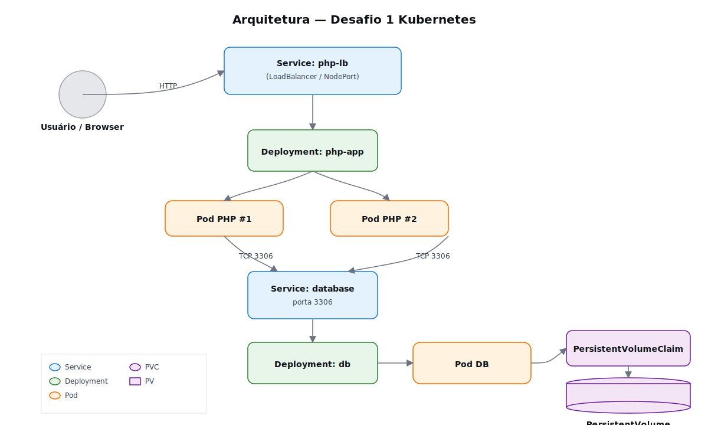
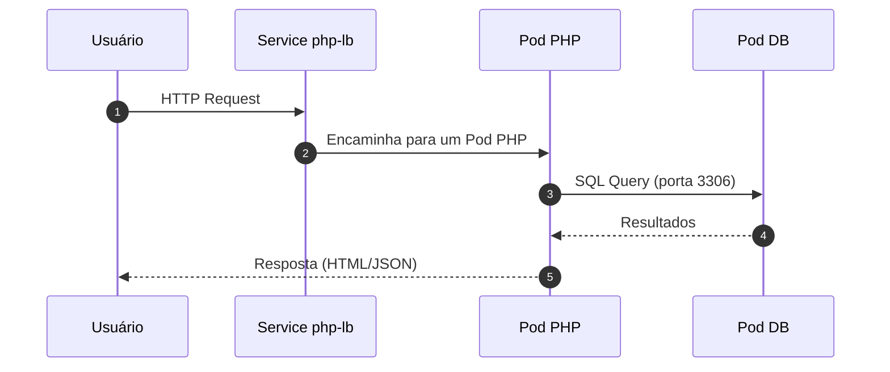

# 🚀 Desafio 1 - Kubernetes DIO

[](#)
[](#)
[](#)
[](#)

Repositório criado para o **Desafio 1 de Kubernetes** da [Digital Innovation One](https://www.dio.me/), contendo a configuração de um ambiente completo com **frontend**, **backend** e **banco de dados** orquestrados no Kubernetes.

---

## 📸 Demonstração

<p align="center">
  
</p>

---

## 📂 Estrutura do Projeto
```bash
desafio1-kubernetes/
├── backend/ # Código e configuração do backend
├── database/ # Scripts e configs do banco de dados
├── frontend/ # Código e configuração do frontend
├── bd-deploy.yml # Deployment do banco de dados
├── php-deploy.yml # Deployment da aplicação PHP
├── php-lb.yml # LoadBalancer para a aplicação PHP
├── pv.yml # Persistent Volume
├── pvc.yml # Persistent Volume Claim
├── script.bat # Script para deploy
└── script_del.bat # Script para remoção
```

---

## 🛠 Tecnologias Utilizadas

- **Kubernetes** (Deployments, Services, PV, PVC)
- **Docker**
- **PHP**
- **HTML / CSS / JavaScript**
- **Batch Scripts**
- **Banco de Dados** (configuração via YAML)

---

## 🗺 Arquitetura

<p align="center">
  
</p>



---

## ⚙️ Como Executar o Projeto

> **Pré-requisitos**:  
> - Kubernetes instalado (minikube, kind ou cluster real)  
> - kubectl configurado  
> - Docker instalado  

1. **Clonar o repositório**
   ```bash
   git clone https://github.com/abrdevelopment/desafio1-kubernetes.git
   cd desafio1-kubernetes

1. **Criar recursos no Kubernetes ou utilizar o arquivo script.bat**
    ```bash
    kubectl apply -f pv.yml
    kubectl apply -f pvc.yml
    kubectl apply -f bd-deploy.yml
    kubectl apply -f php-deploy.yml
    kubectl apply -f php-lb.yml

    # o script abaixo contém a automação dos comandos acima
    .\script.bat


1. **Verificar status**
    ```bash
    kubectl get all

1. **Acessar a aplicação - caso esteja usando o Minikube**
    ```bash
    minikube service --url php-lb

1. **Copiar a URL gerada e inserir no arquivo js.js em Frontend**
    ```bash
    $.ajax({
    url: "http://192.168.56.101:32207", # URL gerada pelo Minikube

## 📌 Observações
Scripts .bat estão disponíveis para facilitar o deploy e a remoção dos recursos.
Ajuste as configurações de acordo com seu ambiente (nome do namespace, imagens Docker, etc.).

O Persistent Volume está configurado para utilizar o Minikube, através do diretório:
```bash
    # configuração contiga em pv.yml
    hostPath:
    path: "/data/pv-local"
```

A senha do usuário root para acesso ao banco está fixa, pois, trata-se apenas de um estudo, utilizar vault ou algum serviço similar para segurança.

## 📄 Licença
Este projeto é de uso educacional e segue a licença definida pelo autor no repositório original.

